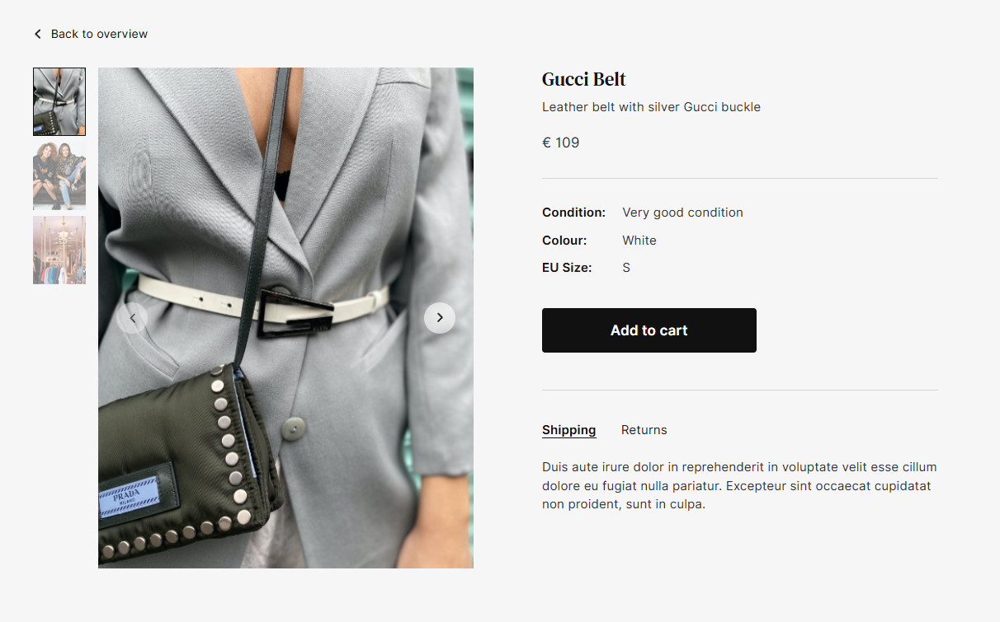

# 🛍️ E-Commerce Platform

A modern, full-stack E-commerce application built with **Django** (backend) and **React** (frontend). This project allows users to browse products, manage carts, process payments, and handle authentication — all in a responsive and visually appealing UI.

---

## 📸 Screenshots

### 🖼️ Product View Page


### 🖼️ Home Page


### 🖼️ Shop Page


---

## 🔧 Tech Stack

### Frontend:
- ⚛️ React
- 📦 Axios
- 📐 TailwindCSS
- 🔄 SwiperJS (Image Slider)
- 🔐 JWT Auth

### Backend:
- 🐍 Django
- 🧩 Django REST Framework
- 📨 SMTP Email (Gmail)
- 🛡️ JWT Authentication

### Directory Structure
---
- ecommerce-project/
- ├── backend/          # Django backend
- │   └── ...
- ├── frontend/         # React frontend
- │   └── ...
- ├── screenshots/      # UI screenshots used in README
- │   ├── home.png
- │   ├── product-view.png
- │   └── cart.png
- └── README.md
---
### Database:
- 🐘 PostgreSQL or
- 🧪 SQLite (for dev/testing)

---

## 🚀 Features

- ✅ User Authentication (Register/Login/Logout)
- 🛍️ Product Listing with Filters
- 🖼️ Image Carousel & Zoom Preview
- 🛒 Add to Cart, Update, Remove
- 💳 Checkout System
- 🧾 Order History
- 📧 Email Notifications
- ⚙️ Admin Panel for Product Management

---

## 🛠️ Setup Instructions

### 🔁 Clone the repo:

```bash
git clone https://github.com/yourusername/ecommerce-django-react.git
cd ecommerce-django-react
